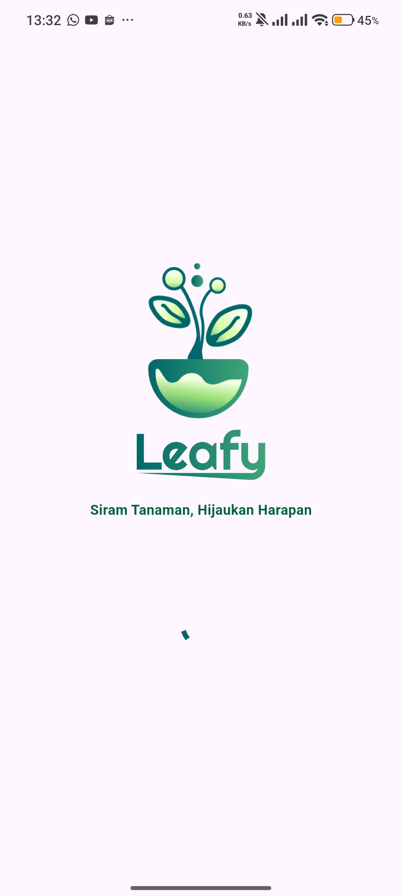
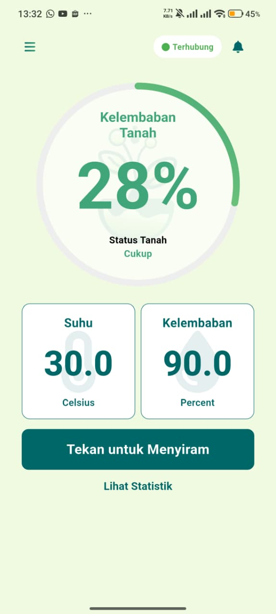
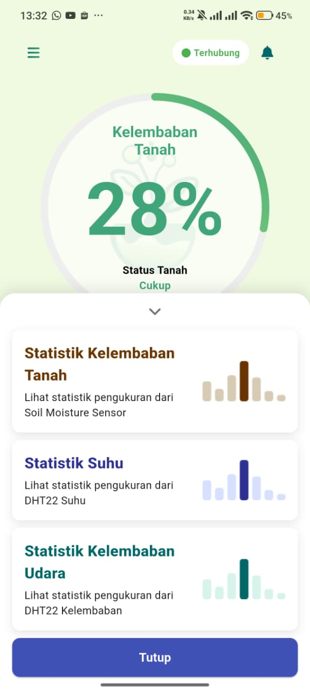
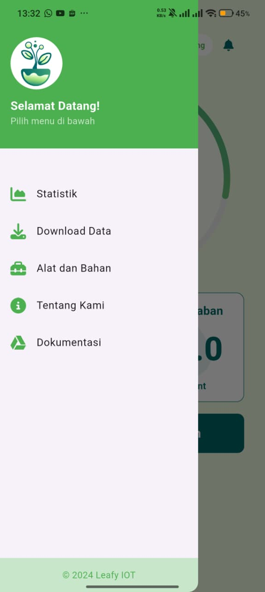
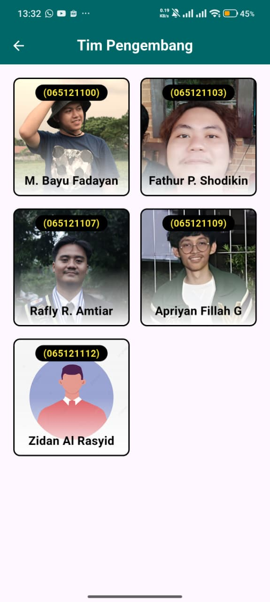
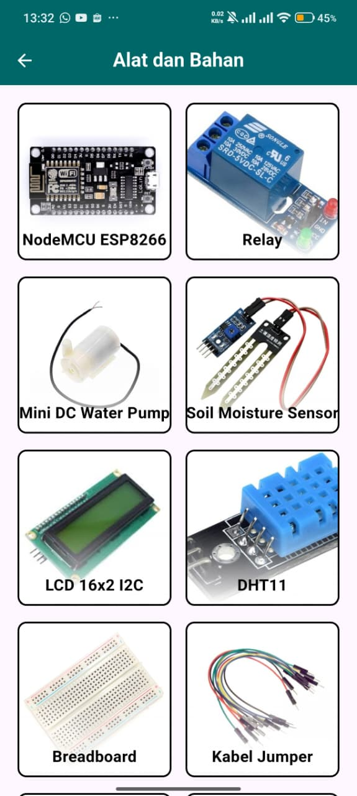

# Leafy IoT Plant Watering System

## Deskripsi Proyek
Leafy IoT Plant Watering System adalah solusi pintar untuk menyiram tanaman secara otomatis menggunakan teknologi IoT. Sistem ini dirancang untuk memantau kelembaban tanah dan menyiram tanaman sesuai kebutuhan, sehingga membantu menjaga tanaman tetap sehat tanpa perlu perawatan manual yang intensif.

## Fitur Utama
- **Pemantauan Kelembaban Tanah**: Sensor kelembaban tanah yang akurat untuk memantau kondisi tanah secara real-time.
- **Penyiraman Otomatis**: Sistem penyiraman yang diaktifkan secara otomatis berdasarkan tingkat kelembaban tanah.
- **Notifikasi**: Pemberitahuan melalui aplikasi saat tanaman membutuhkan perhatian.
- **Integrasi IoT**: Kendali dan pemantauan jarak jauh melalui aplikasi seluler.

## Teknologi yang Digunakan
- **Flutter**: Untuk pengembangan aplikasi seluler.
- **Firebase**: Untuk autentikasi, database, dan notifikasi.
- **Dart**: Bahasa pemrograman utama untuk aplikasi.
- **C++/Platform-Specific Code**: Untuk integrasi perangkat keras.

## Cara Memulai
1. Clone repositori ini:
   ```bash
   git clone https://github.com/username/leafy-iot-plant-watering-system.git
   ```
2. Masuk ke direktori proyek:
   ```bash
   cd leafy-iot-plant-watering-system
   ```
3. Instal dependensi:
   ```bash
   flutter pub get
   ```
4. Jalankan aplikasi:
   ```bash
   flutter run
   ```

## Struktur Proyek
- **lib/**: Berisi kode utama aplikasi Flutter.
- **android/**, **ios/**, **linux/**, **macos/**, **windows/**: Konfigurasi platform spesifik.
- **images/**: Berisi aset gambar dan screenshot.
- **test/**: Berisi pengujian unit dan widget.

## Screenshot
Berikut adalah beberapa tampilan dari aplikasi ini:

<div align="center">
  
  
  
  
  
  
</div>

## Kontribusi
Kami menyambut kontribusi dari siapa pun! Silakan buat pull request atau buka issue untuk diskusi lebih lanjut.

## Lisensi
Proyek ini dilisensikan di bawah [MIT License](LICENSE).
